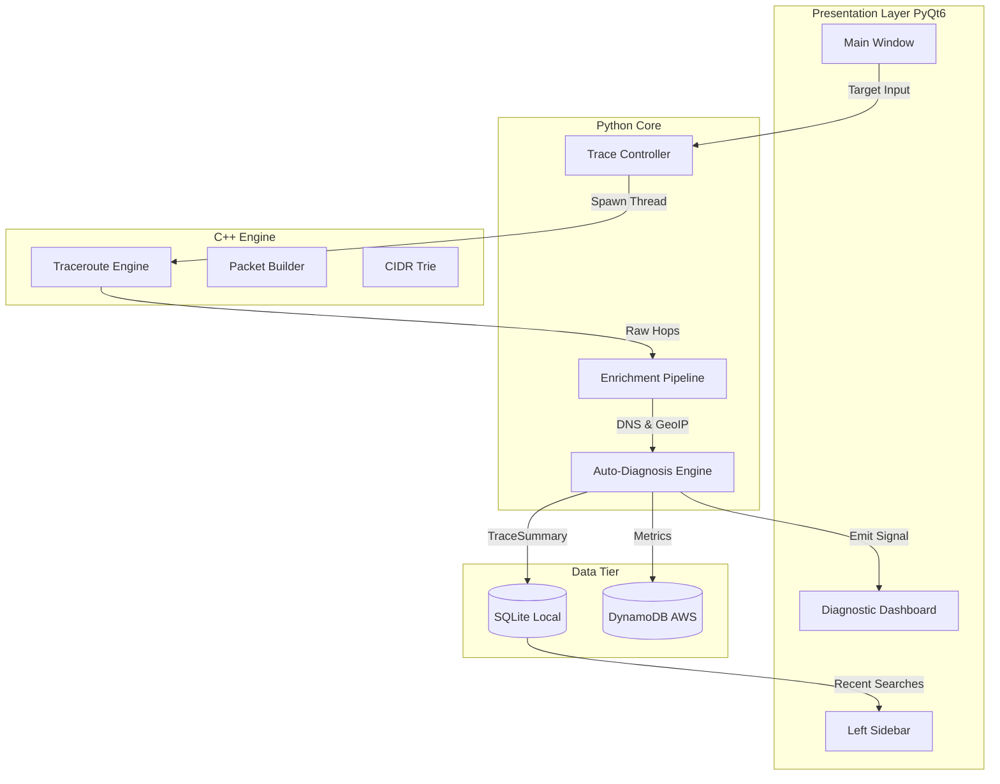

# System Architecture

NetScope is a hybrid-architecture network intelligence platform designed to provide zero-overhead telemetry gathering while maintaining a highly extensible, reactive presentation layer. 

The core philosophy of NetScope is strict separation of concerns between raw packet generation (C++ Engine) and data enrichment/presentation (Python Core).

## High-Level Architecture Diagram

## Layer 1: The C++ Engine (`engine/`)
To achieve sub-millisecond precision, the raw socket manipulation and packet generation bypass the Python GIL and operate directly within the OS network stack. 

### PacketBuilder
The `PacketBuilder` module bypasses standard socket libraries to construct raw IP, ICMP, and UDP packets from scratch.
- **Checksum Calculation**: Implements RFC 1071 compliant checksum algorithms.
- **Protocol Flexibility**: Supports both ICMP Echo Requests and UDP datagrams for tracing through restrictive firewalls.

### Traceroute Executor
Standard traceroutes operate sequentially ($O(N)$ time complexity where $N$ is the number of hops). The NetScope engine implements a sliding-window asynchronous burst strategy.
- **Parallel Probing**: Packets with TTLs 1 through 30 are fired in rapid succession without waiting for the previous ICMP Time Exceeded response. 
- **Socket Multiplexing**: Utilizes high-performance socket polling (`epoll`/`select`) to process returning packets asynchronously, mapping sequence numbers to TTLs to reconstruct the route. This reduces a standard 15-second trace to under 300ms.

### CIDR Trie Lookup
To prevent blocking I/O during cloud provider attribution, NetScope relies on a custom C++ Radix Trie (`CidrTrie`).
- Loads $>10,000$ known CIDR blocks for AWS, GCP, and Cloudflare at startup.
- Achieves strict $O(1)$ lookup time to verify if an IP belongs to a cloud network.

## Layer 2: The Python Core (`netscope/core/`)
The Python core acts as the orchestration and analytical brain. The C++ engine is exposed to Python via PyBind11 bindings (`py_netscope`).

### Concurrency Model
The `TraceController` inherits from `QThread`. When a trace is initiated, it spawns a background thread that invokes the C++ engine. This ensures the main Python event loop (running the GUI) is never blocked, maintaining a strict 60 FPS rendering target.

### Enrichment & Analytics
Once the raw hops return, the Python core enriches the data via concurrent futures. 
- **Reverse DNS**: Executed in a thread pool to prevent slow PTR records from stalling the pipeline.
- **Auto-Diagnosis**: A heuristic engine that evaluates the enriched trace (see `DIAGNOSTICS_ENGINE.md`).

## Layer 3: Presentation (`netscope/gui/`)
The frontend is a strict Model-View-Controller (MVC) implementation built on PyQt6.

### Reactive Rendering
The UI does not poll for data. It relies entirely on Qt's signal/slot architecture. When the `TraceController` completes a phase, it emits a `pyqtSignal(TraceSummary)`, triggering the `DiagnosticDashboard` to redraw.

### Data Visualization
Complex graphing is delegated to `matplotlib`, which is embedded directly into the PyQt window using `FigureCanvasQTAgg`. The backend uses hardware-accelerated rendering where available to handle dynamic scaling of the Latency vs Hop scatter plots without artifacting.
