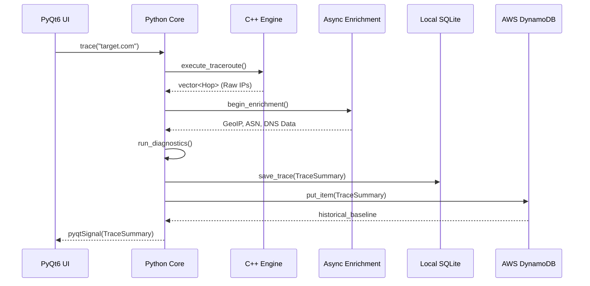

# NetScope Data Pipeline & Persistence

The Data Pipeline is responsible for marshaling unstructured telemetry from raw network sockets into a structured, easily queryable format that is persisted both locally (offline) and in the cloud.

## 1. Trace Data Lifecycle

## 2. Enrichment Concurrency (`netscope/core/enrichment.py`)
Because network traces can involve up to 30 unique IP addresses, performing sequential DNS reverse-lookups would take $>10$ seconds. NetScope solves this using a `ThreadPoolExecutor`.

- **DNS Resolver**: Queries authoritative nameservers asynchronously. 
- **GeoIP Resolution**: MaxMind MMDB lookups are performed entirely locally (using `maxminddb`), achieving $<1ms$ latency per IP.
- **Cloud Detection**: IP addresses are checked against the `CidrTrie` to append Cloud Provider metadata (e.g., "AWS us-east-1", "Cloudflare Edge").

## 3. Storage Tier 1: Local SQLite (`history.db`)
For maximum privacy and offline capability, all detailed trace data is persisted to a local SQLite database (`~/.netscope/history.db`).

- **Schema Design**: A denormalized table `traces` stores top-level metrics (Average Latency, Packet Loss, Health Score), while the complex topology (the individual hops) is serialized into a JSON blob and stored in a `full_data` TEXT column.
- **Performance**: A secondary `recent_searches` table is aggressively indexed to allow the UI to populate the "Recent Searches" panel instantly at startup without parsing the entire `traces` table.

## 4. Storage Tier 2: AWS DynamoDB Cloud Telemetry
To support cross-session and cross-device routing telemetry, NetScope integrates with AWS DynamoDB.

- **Boto3 Integration**: The `DynamoDBClient` is completely decoupled. If the user does not have AWS credentials configured, the module fails silently without interrupting the application flow.
- **Table Schema**:
    - **Partition Key**: `Target (String)` (e.g., `google.com`)
    - **Sort Key**: `Timestamp (String)`
- **Query Optimization**: When a user queries `google.com`, the engine performs a Partition Key query (`KeyConditionExpression=Key("Target").eq(target)`) to retrieve all historical records for that domain in $O(1)$ lookup time.
- **Data Utilization**: The cloud data is aggregated to calculate a long-term historical baseline for a specific target. This baseline is fed directly into `matplotlib` to render a comparative overlay on the latency charts, allowing engineers to instantly visualize "worse than normal" routing behavior.
